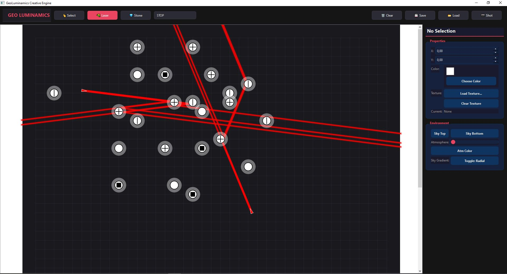

# &nbsp; &nbsp; &nbsp; &nbsp; &nbsp; &nbsp; &nbsp; &nbsp; &nbsp;  G&nbsp;E&nbsp;O&nbsp;L&nbsp;U&nbsp;M&nbsp;I&nbsp;N&nbsp;A&nbsp;M&nbsp;I&nbsp;C&nbsp;S
### THE PRESTIGE OF RADIANCE

<div align="center">
  <p align="center">
    <i>"A convergence of architectural geometry and the weightless purity of light."</i>
  </p>
</div>

---

## ✧ EPHEMERAL LUXURY
**GeoLuminamics** is not merely an engine; it is a curated sanctuary for the digital architect. It is a space where logic dissolves into luminosity, inviting the creator into a state of profound presence and artistic clarity.

---

## 💎 THE CURATED GEOMETRY
Each instrument in the GeoLuminamics collection is crafted for precision, enabling the mastery of the luminous flow.

*   **THE CONDUIT** (🔺) — A Prism of absolute clarity. It guides the momentum of light without hesitation.
*   **THE REFLECTOR** (📐) — A Mirror of perfect fidelity. Redirecting the spectrum with mathematical elegance.
*   **THE RESONATOR** (💎) — A Splitter of infinite potential. Dividing a single source into a symphony of rays.
*   **THE MONOLITH** (⬛) — A Stop of total absolution. Where light is embraced and silenced.

---

## 🎨 THE CREATIVE SOVEREIGNTY
Step beyond the boundary of traditional mechanics into a realm of total expressive freedom. The Creative Engine is your private atelier of light.

*   **✧ ABSOLUTE FLUX** &nbsp;—&nbsp; Sculpt emitters and resonators within the infinite void.
*   **✧ CHROMATIC PRESTIGE** &nbsp;—&nbsp; Define the very essence of every beam with a bespoke RGB palette.
*   **✧ ATMOSPHERIC COUTURE** &nbsp;—&nbsp; Tailor the depth of Bloom, Glow, and Fog to evoke precise emotional states.
*   **✧ KINETIC ELEGANCE** &nbsp;—&nbsp; Orchestrate geometry in perpetual motion with fluid, frame-perfect rotation.
*   **✧ ENVIRONMENTAL MASTERY** &nbsp;—&nbsp; Design horizon-less gradients and sky-scapes of unrivaled serenity.

---

## 🖼️ VISUALIZING THE TRAVEL OF LIGHT
<div align="center">

&nbsp;

### THE LUMINOUS MASTERPIECE

*Where strategic intent meets the effortless beauty of radiance.*

&nbsp;

</div>

---

## 🚀 AWAKENING THE MANIFEST
Experience the premiere state of the engine with effortless initialization.

```powershell
# Curate the Environment
pip install -r requirements.txt

# Transcend to the Creative State
python -m _00_entry.main_creative
```

---

## 🧘 MASTER GESTURES

| INTENT | GESTURE |
| :--- | :--- |
| **Manifest Geometry** | Left Click |
| **Sculpt Orientation** | Right Click |
| **Ignite the Flux** | Space Bar |
| **Temporal Revision** | Ctrl + Z |
| **Preserve the Vision** | Ctrl + S |
| **Release the Moment** | P |

---

## 📜 THE MANIFESTO
GeoLuminamics exists at the intersection of high-tier computation and meditative art. It is a testament to the beauty of the structured void.

*   **P&nbsp;R&nbsp;E&nbsp;S&nbsp;E&nbsp;N&nbsp;C&nbsp;E**
*   **P&nbsp;U&nbsp;R&nbsp;I&nbsp;T&nbsp;Y**
*   **P&nbsp;O&nbsp;W&nbsp;E&nbsp;R**

---

<div align="center">

&nbsp;

**CURATED WITH INTENTION & PURE RADIANCE.**

[](https://ko-fi.com/plantacerium)

⭐ **STAR THE PRESTIGE ON GITHUB** ⭐

&nbsp;

</div>
